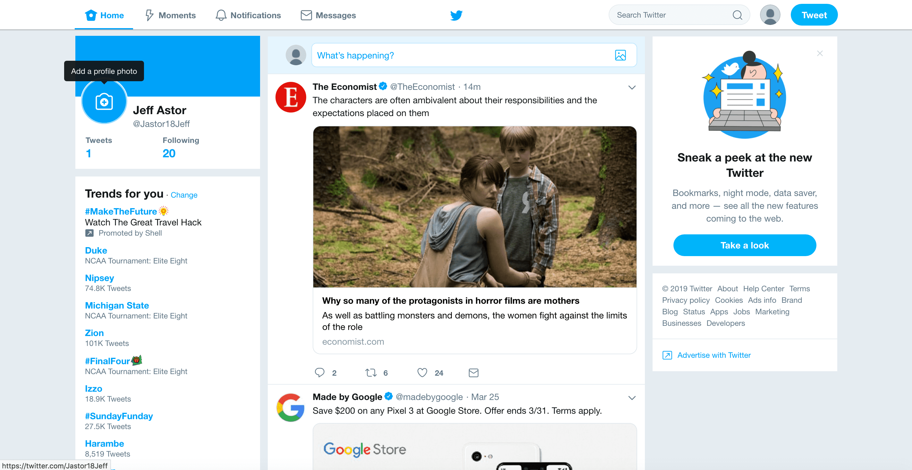

# Twitter A/B Test Lab

Twitter needs your help running an A/B test for their new UI. An A/B test is where an experimenter shows different UI screens to users to determine which interface they prefer.

Previously Twitter's feed page looked like this:



Your goal is to use React to update the Twitter UI to give it a fresh and modern look. You can check out [Twitter's website](https://www.twitter.com) to see how it looks now.

Follow the instructions available on the [course portal](https://courses.codepath.org/courses/summer_internship_for_tech_excellence/unit/2#!lab2)

## Setting up the lab

Make sure to install the proper dependencies.

```bash
npm install
```

Once that's done, run the application like so:

```bash
npm run dev
```

## Application Features

### Core Features

- [ ] The `UserProfile` component displays name, username, and number of tweets.
- [ ] The `Feed` component displays an array of tweets and adds tweets in order of most recent at the bottom.
- [ ] The `TweetInput` component takes in tweets that are a maximum of 140 characters. A character countdown appears as a user is typing.
- [ ] The `TweetInput` expands and pushes the feed down to accommodate a larger text area when text in the handler is clicked.

### Stretch Features

- [ ] Create a new component so users can add an image to the user profile that is displayed where the avatar icon goes.
- [ ] Modify the `Tweet` component to store its own internal state. Whenever a user clicks on the heart, it should increment the number of likes for that tweet.
- [ ] Make the `Tweet` component collapsible by clicking on the downward-facing chevron icon in the top-right of the component.
- [ ] Add styling so that all hash tags are colored light blue.
- [ ] In the `TweetInput` component, allow a menu of emojis to appear when the user clicks on the smiley face. Clicking on an emoji should append it to the tweet text.
- [ ] **Extra Stretch:** Create a modal that pops up whenever the user clicks on the retweet icon. It should give the user the ability to retweet that particular tweet and increment the number of retweets.
