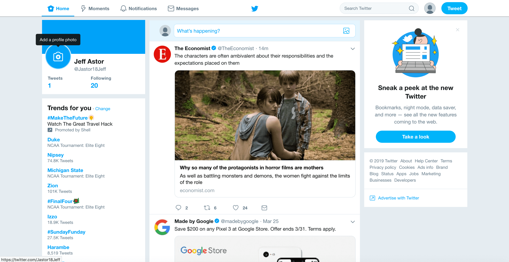

# Twitter A/B Test Lab

Week 2 - React Lab #2

## Intro

Twitter has kindly asked SITE interns to help them run an A/B test for their new UI. An A/B test is where an experimenter shows different UI screens to users and determines which interface they prefer.

Previously Twitter's feed page looked like this:



Go to `https://www.twitter.com` now to see their modern UI.

The task here will be to write code that specs out the old user interface with modern React code.

Follow the instructions available on the [course portal](courses.codepath.org/courses/summer_internship_for_tech_excellence/unit/2#!lab2)

## Setting up the lab

Make sure to install the proper dependencies.

```bash
npm install
```

Once that's done, run the application like so:

```bash
npm run dev
```
